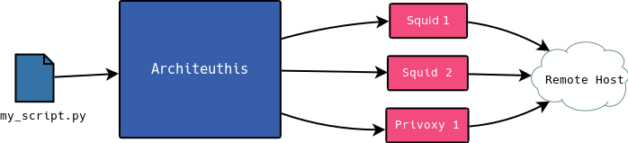

# Architeuthis 🦑

[](https://www.codefactor.io/repository/github/simon987/architeuthis)


*NOTE: this is very WIP* 

HTTP(S) proxy with integrated load-balancing, rate-limiting
and error handling. Built for automated web scraping.

* Strictly obeys configured rate-limiting for each IP & Host
* Seamless exponential backoff retries on timeout or error HTTP codes
* Requires no additional configuration for integration into existing programs

### Typical use case


### Sample configuration

```json
{
  "addr": "localhost:5050",
  "proxies": [
    {
      "name": "squid_P0",
      "url": "http://p0.exemple.com:8080"
    },
    {
      "name": "privoxy_P1",
      "url": "http://p1.exemple.com:8080"
    }
  ],
  "hosts": {
    "*": {
      "every": "750ms",
      "burst": 5,
      "headers": {}
    },
    "reddit.com": {
      "every": "2s",
      "burst": 1,
      "headers": {"User-Agent":  "mybot_v0.1"}
    }
  }
}
```

